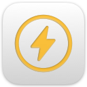

# Read Focus - Chrome Extension

<div align="center">
  
  <h3>Stay focused on reading without distractions</h3>
  <p>A Chrome extension that helps you concentrate on reading by providing a distraction-free environment.</p>
</div>

## 🎯 Features

### 🎨 Focus Mode
- **One-click activation**: Enter focus mode with a single click
- **Fullscreen reading**: Automatic fullscreen mode for immersive reading
- **Clean layout**: Hide navigation bars, sidebars, ads, and other distractions
- **Link blocking**: Prevent accidental clicks on distracting links

### 🖍️ Text Highlighting
- **Smart highlighting**: Select text and highlight with `Ctrl/Cmd + H`
- **Click to remove**: Click highlighted text to remove highlights
- **Persistent storage**: Highlights are saved locally and restored on page reload
- **Visual feedback**: Clear yellow highlighting for important content

### 📝 Note-taking & Excerpts
- **Excerpt collection**: Save important content to your personal excerpt list
- **Sidebar panel**: Toggle excerpt panel with `Ctrl/Cmd + Shift + L`
- **Export functionality**: Export all excerpts as Markdown format
- **Local storage**: All data stored locally for privacy

### ⌨️ Keyboard Shortcuts
- **Escape**: Exit focus mode
- **Ctrl/Cmd + H**: Highlight selected text
- **Ctrl/Cmd + Shift + L**: Toggle excerpt panel

## 🚀 Installation

### From Chrome Web Store
*Coming soon...*

### Development Installation
1. Clone this repository:
   ```bash
   git clone https://github.com/yourusername/read-focus-chrome-extension.git
   cd read-focus-chrome-extension
   ```

2. Open Chrome and navigate to `chrome://extensions/`
3. Enable "Developer mode" in the top right
4. Click "Load unpacked" and select the extension directory
5. The Read Focus extension should now appear in your extensions list

## 📁 Project Structure

```
read-focus-chrome-extension/
├── manifest.json          # Chrome Manifest V3 configuration
├── background.js          # Service worker for extension
├── content.js            # Content script (core functionality)
├── popup.html            # Extension popup interface
├── popup.js              # Popup interaction logic
├── popup.css             # Popup styling
├── icons/                # Extension icons
│   ├── icon16.png        # 16x16 icon
│   ├── icon32.png        # 32x32 icon
│   ├── icon48.png        # 48x48 icon
│   └── icon128.png       # 128x128 icon
├── images/               # Additional image resources
├── _locales/             # Internationalization support
│   └── en/
│       └── messages.json
└── README.md             # This file
```

## 🛠️ Development

### Prerequisites
- Chrome browser (version 88+)
- Basic knowledge of HTML, CSS, and JavaScript

### Building
This extension doesn't require a build process. Simply load the directory in Chrome's developer mode.

### Testing
1. Load the extension in Chrome developer mode
2. Visit any webpage
3. Click the extension icon to test the popup
4. Test focus mode functionality
5. Test highlighting and excerpt features

### Code Structure
- **`manifest.json`**: Extension configuration and permissions
- **`background.js`**: Handles extension icon clicks and coordinates content script injection
- **`content.js`**: Core functionality including focus mode, highlighting, and excerpt management
- **`popup.html/js`**: User interface for quick access to extension features

## 🎨 Usage

### Basic Usage
1. **Enter Focus Mode**: Click the extension icon and select "Enter Focus Mode"
2. **Highlight Text**: Select any text and press `Ctrl/Cmd + H`
3. **Manage Excerpts**: Click "摘录" (Excerpts) to view your saved content
4. **Export Data**: Click "导出" (Export) to copy all excerpts as Markdown

### Advanced Features
- **Link Control**: Toggle link blocking on/off while in focus mode
- **Keyboard Navigation**: Use keyboard shortcuts for quick access
- **Data Persistence**: All highlights and excerpts are saved locally

## 🔧 Configuration

### Permissions
The extension requests the following permissions:
- **Storage**: To save highlights and settings locally
- **Active Tab**: To access the current webpage for reading enhancement
- **Scripting**: To inject reading enhancement features
- **All URLs**: To work on any website you visit

### Privacy
- **No data collection**: All data is stored locally on your device
- **No tracking**: No analytics or tracking systems
- **No external requests**: Extension works entirely offline

## 📦 Distribution

### Chrome Web Store
This extension is designed for submission to the Chrome Web Store. The `manifest.json` file is configured for Manifest V3 compatibility.

### Packaging
To create a distribution package:
```bash
zip -r read-focus-chrome-extension.zip . -x "*.git*" "*.DS_Store*" "test-*"
```

## 🤝 Contributing

1. Fork the repository
2. Create a feature branch: `git checkout -b feature-name`
3. Make your changes
4. Test thoroughly
5. Commit your changes: `git commit -m "Add feature"`
6. Push to the branch: `git push origin feature-name`
7. Submit a pull request

### Development Guidelines
- Follow Chrome extension best practices
- Test on multiple websites
- Ensure accessibility compliance
- Maintain backward compatibility

## 📄 License

This project is licensed under the MIT License - see the [LICENSE](LICENSE) file for details.

## 🐛 Bug Reports

If you find a bug, please create an issue with:
- Description of the problem
- Steps to reproduce
- Expected behavior
- Screenshots (if applicable)
- Browser version and OS

## 🚀 Roadmap

- [ ] Multi-language support
- [ ] Custom highlight colors
- [ ] Cloud sync (optional)
- [ ] Advanced export formats
- [ ] Reading statistics
- [ ] Custom themes

## 📞 Support

- **Issues**: [GitHub Issues](https://github.com/yourusername/read-focus-chrome-extension/issues)
- **Discussions**: [GitHub Discussions](https://github.com/yourusername/read-focus-chrome-extension/discussions)
- **Email**: [Your Email]

---

<div align="center">
  <p>Made with ❤️ for better reading experience</p>
  <p>⭐ Star this repository if you find it helpful!</p>
</div>
